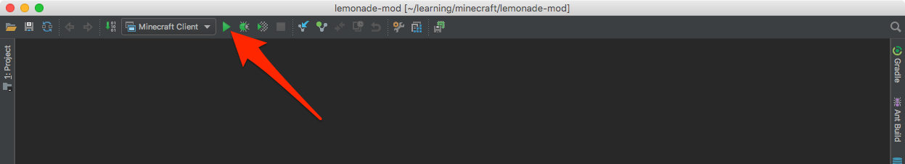

# Setup {#setup}

## Download Forge MDK

Grab version 1.12 of the Forge Mod Development Kit:

1. Browse to <http://files.minecraftforge.net/>
1. Click on the "Mdk" icon in "Download Recommended"
1. Click the "SKIP" button when it appears at the top right to go past the ad
1. Save the forge-1.12.x-xx.x.x-mdk.zip file
1. Create a directory for your mod and unzip the mdk into it

For example:

```shell
$ mkdir lemonade-mod
$ cd lemonade-mod
$ unzip ~/Dowloads/forge-1.12.2-14.23.4.2705-mdk.zip
```

## Set up for IntelliJ IDEA

```shell
$ ./gradlew setupDecompWorkspace idea
```

## Open in IntelliJ IDEA

1. Click "Open"
1. Navigate to your mod folder and click "Open"
1. Click "Import Gradle project" at the bottom right
1. Click "OK" to the popup

## Run inside IntelliJ IDEA

1. Ensure "Minecraft Client" is the active run configuration in the toolbar
1. Click the "Run" icon in the toolbar


